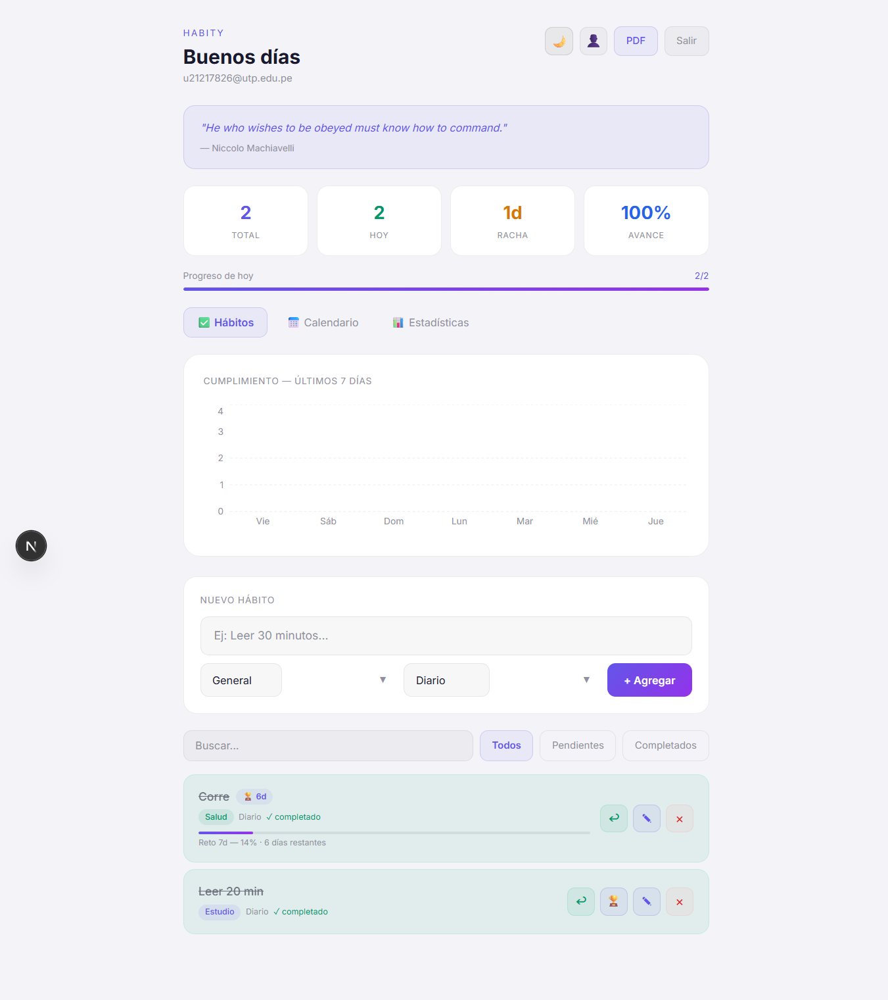
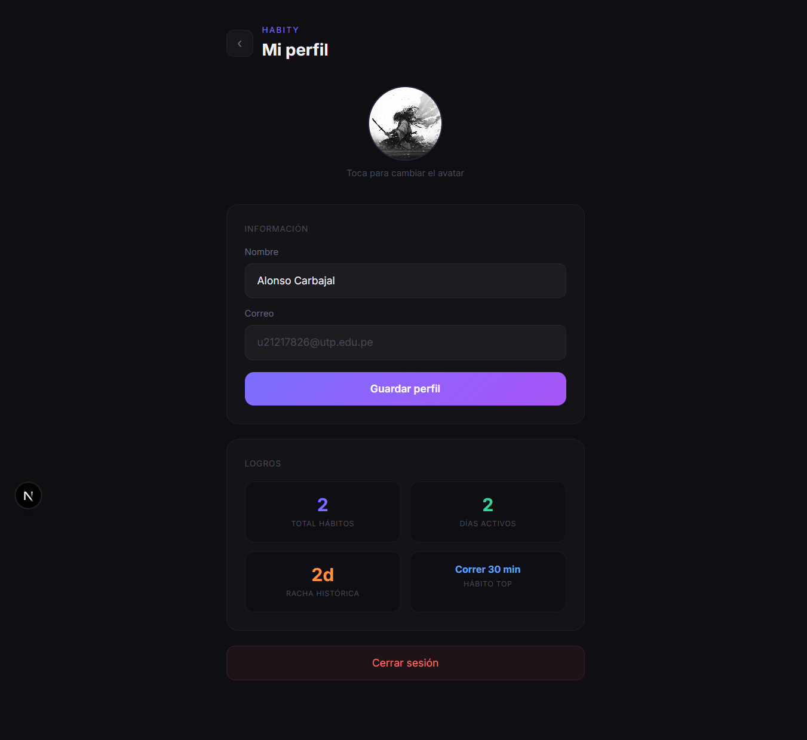
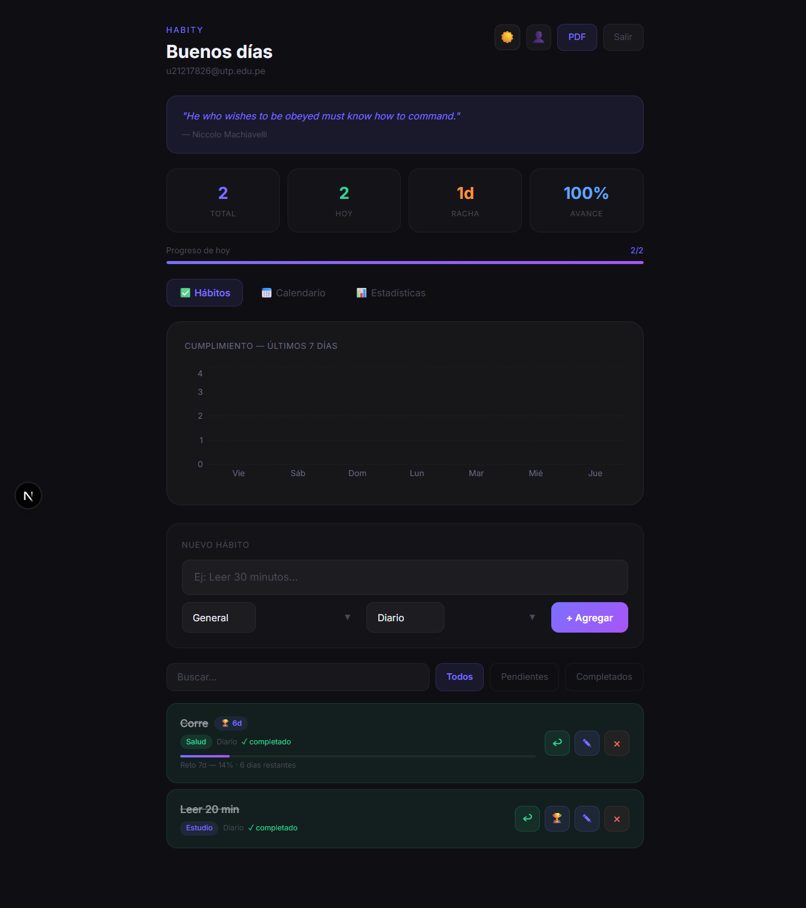
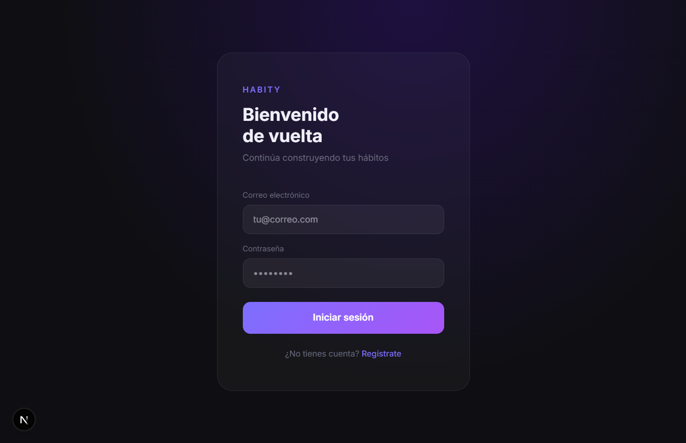
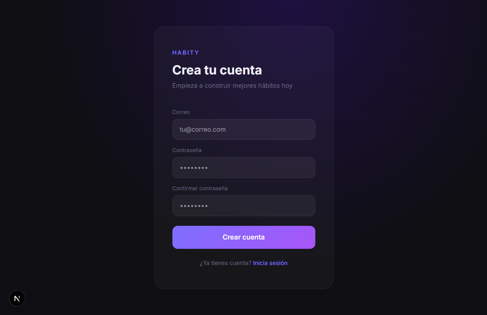
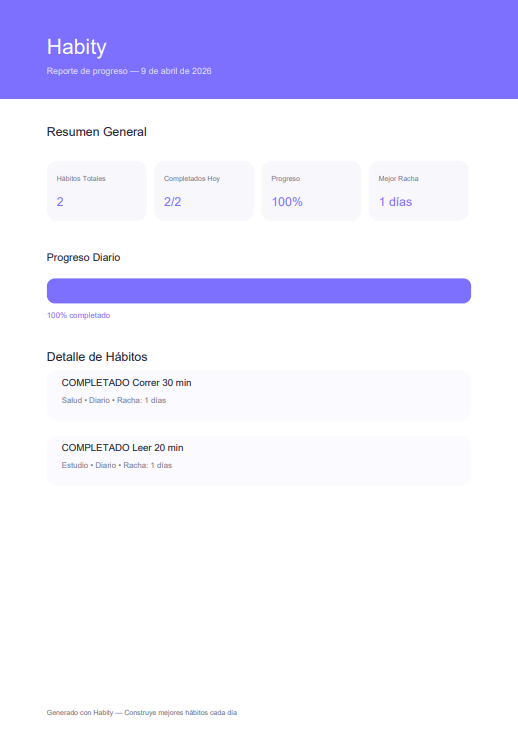

<div align="center">

# 🔥 Habity

**Aplicación web de seguimiento de hábitos para construir consistencia, monitorear progreso y mejorar disciplina diaria.**

[](https://habity-jet.vercel.app)
[](https://supabase.com)
[](https://nextjs.org)
[](LICENSE)

[🌐 Explorar la aplicación](https://habity-jet.vercel.app)

---

</div>

## ✨ Funcionalidades

- **Autenticación segura** — Registro y login con email/password + confirmación por correo
- **Gestión de hábitos** — Crear, editar y eliminar hábitos con categoría y frecuencia
- **Rachas diarias** — Seguimiento visual de racha activa con indicador de fuego 🔥
- **Retos personales** — Desafíos de 7, 21, 30 o 66 días con barra de progreso
- **Notas por sesión** — Registra cómo te sentiste al completar cada hábito
- **Calendario visual** — Mapa mensual de progreso con colores por intensidad
- **Estadísticas** — Gráfica de barras y línea de los últimos 7 días + tasa de éxito por hábito
- **Exportar PDF** — Reporte diario descargable con resumen y progreso
- **Dark / Light mode** — Persistido en localStorage
- **Frase motivacional diaria** — Vía API externa (zenquotes.io)
- **Perfil de usuario** — Nombre y avatar (subida a Supabase Storage)

## 🛠️ Stack tecnológico

| Tecnología | Uso |
|---|---|
| [Next.js 16](https://nextjs.org/) | Framework Fullstack |
| [React](https://react.dev/) | UI |
| [TypeScript](https://www.typescriptlang.org/) | Tipado estático |
| [Tailwind CSS](https://tailwindcss.com/) | Estilos |
| [Supabase](https://supabase.com/) | Auth, PostgreSQL, Storage, RLS |
| [@supabase/ssr](https://supabase.com/docs/guides/auth/server-side) | Manejo de sesiones SSR |
| [Recharts](https://recharts.org/) | Gráficos |
| [jsPDF](https://github.com/parallax/jsPDF) | Exportación PDF |
| [Vercel](https://vercel.com/) | Deploy |

---

## 📸 Capturas de Pantalla

<div align="center">

### 🏠 Dashboard Principal

<p><i>Vista general del progreso, hábitos activos y resumen diario.</i></p>

---

### 📊 Panel de Estadísticas

<p><i>Gráficos de rendimiento, cumplimiento semanal y métricas clave.</i></p>

---

### 📆 Calendario de Progreso

<p><i>Mapa visual de consistencia y actividad histórica.</i></p>

---

<table>
<tr>
<td align="center" width="50%">

<br />
<b>🔐 Login</b>
</td>
<td align="center" width="50%">

<br />
<b>📝 Registro</b>
</td>
</tr>
</table>

<br />

### 📄 Exportación PDF

<p><i>Reporte profesional descargable del progreso diario.</i></p>

</div>

---

## 🗄️ Base de Datos (Supabase)

### Tablas principales

- **habits** → Información base de hábitos  
- **habit_logs** → Historial de cumplimiento  
- **challenges** → Retos activos/completados  
- **profiles** → Perfil del usuario  

---

### Políticas RLS recomendadas

Habilita RLS en todas las tablas y agrega políticas tipo:

```sql
-- Ejemplo para habits
CREATE POLICY "Users can manage own habits"
ON habits FOR ALL
USING (auth.uid() = user_id);

-- Ejemplo para habit_logs
CREATE POLICY "Users can manage own logs"
ON habit_logs FOR ALL
USING (auth.uid() = user_id);

-- Ejemplo para challenges
CREATE POLICY "Users can manage own challenges"
ON challenges FOR ALL
USING (auth.uid() = user_id);

-- Ejemplo para profiles
CREATE POLICY "Users can manage own profile"
ON profiles FOR ALL
USING (auth.uid() = id);
```

## 🚀 Instalación local

```bash
# 1. Clona el repositorio
git clone https://github.com/alowincr/habity.git
cd habity

# 2. Instala dependencias
npm install

# 3. Configura variables de entorno
cp .env.example .env.local
# Edita .env.local con tus credenciales de Supabase

# 4. Corre en desarrollo
npm run dev
```

## 🔑 Variables de entorno

Crea un archivo `.env.local` en la raíz:

```env
NEXT_PUBLIC_SUPABASE_URL=https://tu-proyecto.supabase.co
NEXT_PUBLIC_SUPABASE_ANON_KEY=tu-anon-key
```

> Estas variables son públicas por diseño — Supabase las expone al cliente intencionalmente. La seguridad real está en las políticas RLS de la base de datos.

## ☁️ Deploy en Vercel

1. Conecta el repositorio en [vercel.com](https://vercel.com)
2. Agrega las variables de entorno en Vercel → Settings → Environment Variables
3. En Supabase → Authentication → URL Configuration agrega:
   - `https://tu-dominio.vercel.app/**` en **Redirect URLs**
4. En Supabase → Storage → crea el bucket `avatars` con política de lectura pública
5. Haz deploy 🚀

## 📦 Scripts

```bash
npm run dev      # Desarrollo con Turbopack
npm run build    # Build de producción
npm run start    # Servidor de producción
npm run lint     # Linter
```

## 🔒 Seguridad

- Autenticación manejada completamente por Supabase Auth
- Row Level Security (RLS) activo en todas las tablas
- Middleware de Next.js protege todas las rutas privadas
- Sin API keys privadas expuestas en el cliente
- Sesiones manejadas con cookies HttpOnly vía `@supabase/ssr`

## 📄 Licencia

MIT — proyecto personal desarrollado como práctica de arquitectura fullstack moderna.

<div align="center">

**Desarrollado por Alonso 🚀**
